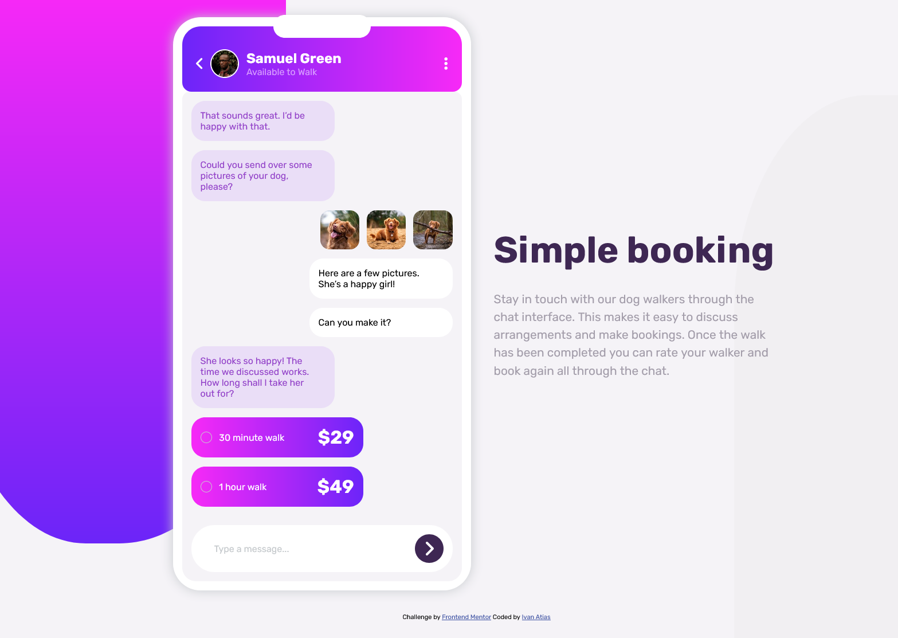

# Frontend Mentor - Chat app CSS illustration solution

This is a solution to the [Chat app CSS illustration challenge on Frontend Mentor](https://www.frontendmentor.io/challenges/chat-app-css-illustration-O5auMkFqY). Frontend Mentor challenges help you improve your coding skills by building realistic projects.

# Screenshot

# Built with

- Semantic HTML5 markup
- CSS custom properties
- Flexbox

## Author

- Website - [Ivan Atias](https://ivanatias.codes)
- Frontend Mentor - [@ivanatias](https://www.frontendmentor.io/profile/ivanatias)
